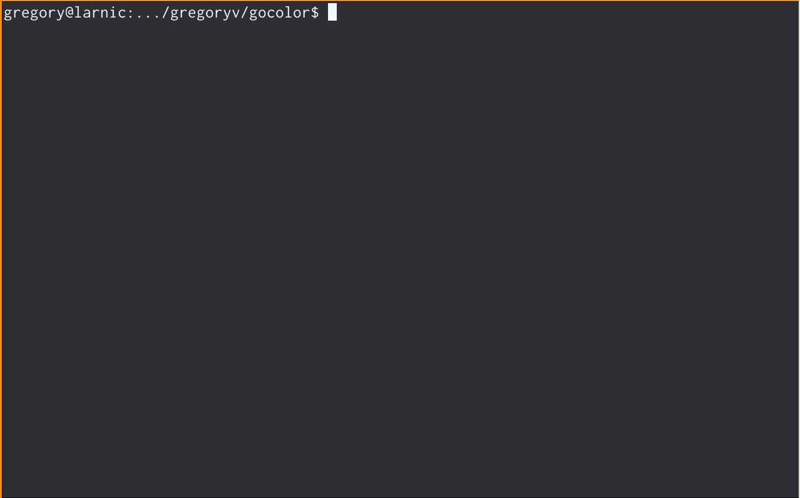

gocolor - basic coloring of go test output

Gocolor simplifies scanning for successful or failed test cases. For
 easy pipeline integration the command will use exit code 1 if a
 failed test is found.

# Quick start

    $ go install github.com/gregoryv/gocolor/cmd/gocolor@latest
	$ go test -v ./... | gocolor
	

