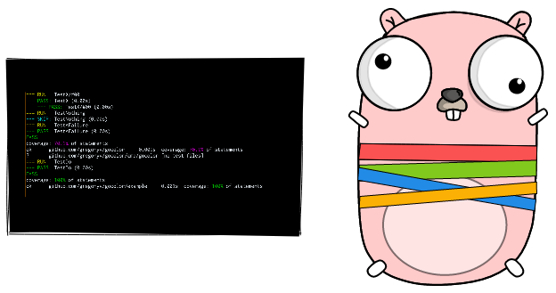

gocolor - basic coloring of go test output

Gocolor simplifies scanning for successful or failed test cases. For
 easy pipeline integration the command will use exit code 1 if a
 failed test is found.

# Quick start

    $ go install github.com/gregoryv/gocolor/cmd/gocolor@latest
	$ go test -v ./... | gocolor
	

# Features

## Default

This tool was initially developed to color go test output for easy
scanning of pass-, skip- and failed tests. By default those prefixes
will be colored in a fixed set of colors.

## Custom

For any other coloring you can supply custom colors on the command line

    $ echo "hello my friend" | gocolor "hello:red" "friend:green;blink;dim"

## Configured

From v0.9.0 you can configure a set of default coloring expressions in
either local .gocolor or $HOME/.gocolor file; one expression on each
line, e.g.

    error:red
	warning:cyan
	info:green
	panic:bgred;white;blink

